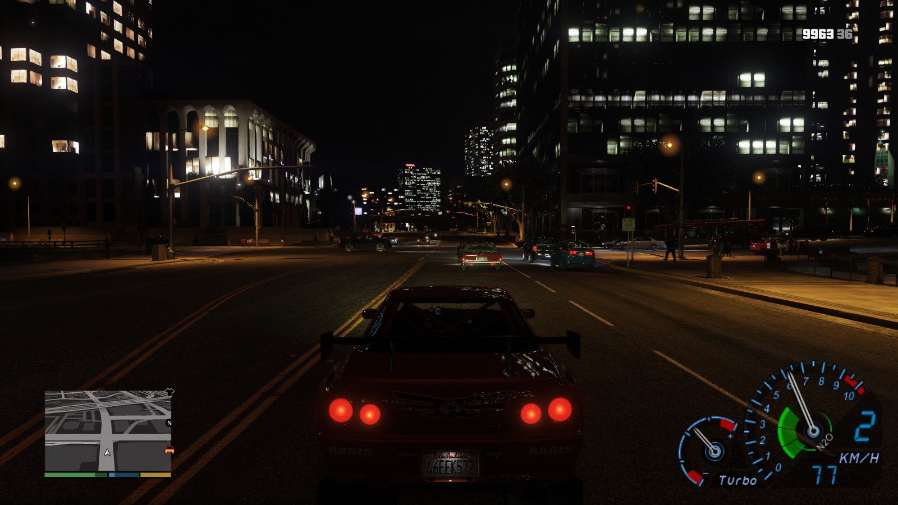

[comment]: # (GitHub README.md)

GTA V Speedometer
=========================

*Yet another* speedometer! Since other speedo devs have been either unresponsive or unwilling to add stuff, and I myself want to have some stuff added, well, time for my own speedo.

## Requirements
* Grand Theft Auto V
* [ScriptHookV by Alexander Blade](http://www.dev-c.com/gtav/scripthookv/)

## Downloads

* None yet

## Building

### Requirements
* [ScriptHookV SDK by Alexander Blade](http://www.dev-c.com/gtav/scripthookv/)
* [GTAVMenuBase](https://github.com/E66666666/GTAVMenuBase)
* [GTAVManualTransmission](https://github.com/E66666666/GTAVManualTransmission)

Download the [ScriptHookV SDK](http://www.dev-c.com/gtav/scripthookv/) and extract its contents to ScriptHookV_SDK.

Clone this repository to the same folder ScriptHookV_SDK was extracted so you have ScriptHookV_SDK and GTAVManualTransmission in the same folder. If you get build errors about missing functions, update your [natives.h](http://www.dev-c.com/nativedb/natives.h). The menu base repo contains the currently used natives.h to build stuff.

Clone my [GTAVMenuBase](https://github.com/E66666666/GTAVMenuBase) to the same folder you're gonna clone this to.

Clone my [GTAVManualTransmission](https://github.com/E66666666/GTAVManualTransmission) to the same folder you're gonna clone this to. We're gonna need (some of) those extra vehicle natives.

## Decorators

This script reads the following decorators:

* `int` - `mt_neutral`: Gear neutral position, from the Manual Transmission mod
* `int` - `mt_shift_indicator`: Shift indicator, from the Manual Transmission mod
* `int` - `ikt_speedo_nos`: Presence of a nitrous mod
* `float` - `ikt_speedo_nos_level`: Nitrous level, between 0.0f and 1.0f

To make the green N2O bars appear in the speedometer, your mod has to set `ikt_speedo_nos` to 1 on the currently used vehicle, set it to 0 to remove.

N2O level ranges from 1.0f to 0.0f. Again, set `ikt_speedo_nos_level` to this level on the currently used vehicle.

N2O bars also appear for vehicles with a rocket boost - the rocket boost takes precedence over any external mods.
